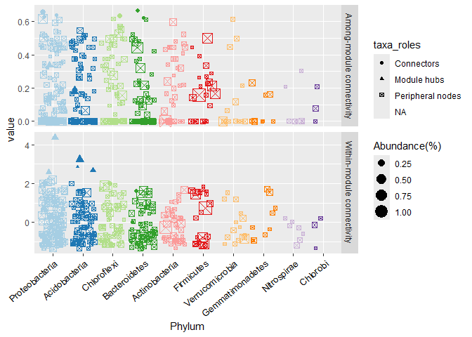
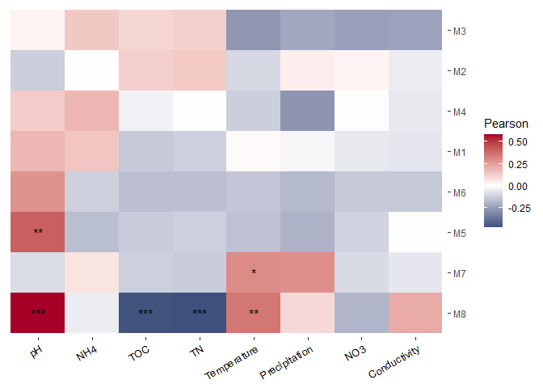

#### Credit where its due

  Much of the pipeline and tutorial here is adapted from Phyloseq, microeco, and gephi.

## About Networks
  Networks are used all around: Political science, games, ecology, metabolics, etc. Co-occurrence networks assume that when two subjects, such as animals, people, or virtual connections, are frequently appearing together that they are associating in some way. For example, two people frequently messaging on social media are likely friends and an individual who is often messaged or retweeted is important to the structure of the community they've surrounded themselves with, just like an influencer.
  We can do similar things with microbial communities. By looking at Amplicon sequencing data from environmental samples. we can see which species or taxa often occur together. This can imply potential interactions (such as predation or symbiosis) or a reliance on similar conditions for survival. One of the most important parts about networks is that the statistics are all dependent, and it is this dependency that interests us.
  To that end, we use microeco (https://github.com/ChiLiubio/microeco) to explore networks as it allows for the conversion of phylseq objects to microeco objects, the generation of networks, and various statistical tests to explore how network metrics correlate to environmental factors. Though microeco does allow for visualization, we use Gephi which is a program meant for the visualization of networks. Instructions for download can be found online (https://gephi.org/).
  
  Load the following packages:

```r
library(readxl)
library(openxlsx2)
```

```
## 
## Attaching package: 'openxlsx2'
```

```
## The following object is masked from 'package:readxl':
## 
##     read_xlsx
```

```r
library(BiocManager)
```

```
## Bioconductor version '3.18' is out-of-date; the current release version '3.19'
##   is available with R version '4.4'; see https://bioconductor.org/install
```

```r
library(phyloseq)
library(dada2)
```

```
## Loading required package: Rcpp
```

```r
library(microeco)
library(file2meco)
library(magrittr)
library(ggh4x)
```

```
## Loading required package: ggplot2
```

```
## 
## Attaching package: 'ggh4x'
```

```
## The following object is masked from 'package:ggplot2':
## 
##     guide_axis_logticks
```

```r
library(rgexf)
library(paletteer)
library(igraph)
```

```
## 
## Attaching package: 'igraph'
```

```
## The following objects are masked from 'package:stats':
## 
##     decompose, spectrum
```

```
## The following object is masked from 'package:base':
## 
##     union
```

```r
library(pulsar)
library(CoDaSeq)
```

```
## Loading required package: ALDEx2
```

```
## Loading required package: zCompositions
```

```
## Warning: package 'zCompositions' was built under R version 4.3.3
```

```
## Loading required package: MASS
```

```
## Loading required package: NADA
```

```
## Loading required package: survival
```

```
## 
## Attaching package: 'NADA'
```

```
## The following object is masked from 'package:stats':
## 
##     cor
```

```
## Loading required package: truncnorm
```

```
## Loading required package: lattice
```

```
## Loading required package: latticeExtra
```

```
## 
## Attaching package: 'latticeExtra'
```

```
## The following object is masked from 'package:ggplot2':
## 
##     layer
```

```
## Loading required package: car
```

```
## Loading required package: carData
```
## Network Generation & Visualization in Gephi
Step one is to convert our phyloseq object into a microeco object. This will be using functions from the file2meco package.


```r
#Loading Phyloseq object from library
data(GlobalPatterns)
meco<-phyloseq2meco(GlobalPatterns)
```

```
## 228 taxa with 0 abundance are removed from the otu_table ...
```

```r
#when converting to a meco object, it will "clean up" the OTU and Taxa table by removing those that have 0 abundances across all samples. In truth, this causes issues down the line so we have to tidy the dataset before moving on. It is also important to run this function anytime you modify the microeco object by filtering, subgrouping, etc.
meco$tidy_dataset()
```
  Meco objects are a little special. If you inspect it directly you will be able to see various objects such as cal_abund, otu_tables, sample_table, and so much more. Meco objects stores the taxa table, otu table, and metadata file from phyloseq but it also stores the functions which the package calls on (such as cal_abund). This can make troubleshooting or modifying steps in the process a bit difficult unless you are familiar with messing around with functions in R.
  Now that we have this object, we can begin exploring networks!


```r
#Dataset should be the microeco object, cor_methods are elaborated on the microeco page. Taxa level can be specified to any level. Lets look at this network from a Family level.
network<-trans_network$new(dataset = meco, cor_method = "spearman",filter_thres = .0001,
                          taxa_level = "Family")
```

```
## After filtering, 232 features are remained ...
```

```
## The correlation result list is stored in object$res_cor_p ...
```

```r
#With our network created, we can now calculate it. In this case we have our significance set to 95% confidence (p=.5) and have a correlation cutoff of .6.Additionally, we use the add_taxa_name function as it facilatates exporting this important information to gephi.
network$cal_network(COR_p_thres = .05,COR_cut=.6,add_taxa_name = c("Kingdom",
  "Phylum","Class","Order","Family","Genus","Species"))
```

```
## ---------------- 2024-07-26 14:36:29.526483 : Start ----------------
```

```
## Perform p value adjustment with fdr method ...
```

```
## ---------------- 2024-07-26 14:36:29.863887 : Finish ----------------
```

```
## Skip adding taxonomy: Genus to node as it is not in colnames of tax_table ...
```

```
## Skip adding taxonomy: Species to node as it is not in colnames of tax_table ...
```

```
## The result network is stored in object$res_network ...
```

```r
#Now that is has calculated which members of the network are significant, we calculate how our modules are shaped. Again, the microeco page has more information on the different methods.
network$cal_module(method = "cluster_fast_greedy")
```

```
## Use cluster_fast_greedy function to partition modules ...
```

```
## Totally, 4 modules are idenfified ...
```

```
## Modules are assigned in network with attribute name -- module ...
```

```r
#Finally, we export the object as a gephi file.
network$save_network(filepath = "network.gexf")
```

  Great, we have a network! The fun part of visualizing it occurs in Gephi. First, we have to open gephi and open our new Gephi file which should be saved in the same place as your R repository:


  When you open it, a screen like this should appear. Simply make sure that graph type is "undirected" and hit ok.


  
  
  Now your network is in! And looking like a weird orange glob. Since this isn't the most imformative, lets use Gephi's tool to improve the appearance of this network. First, lets work in the appearance tab. From here we can modify the color, size, labels, and text of nodes and edges. Lets change the color of our nodes so that they represent their Family.
  To do so, we click on the paint pallete symbol and make sure node is selected. Click on the partition tab and select Family. Hit apply.
  
  
  
  
  Well, it seems that there aren't enough colors in the palette. Lets generate a better palette. We can do so by clicking Palette... above apply. From here, we click on generate. Turn of "limit number of colors" and hit generate. You are also able to change the range of colors through the "presets" dropdown.
  
  
  
  

  Now we can hit Ok and when we check our palette options you should see the new palette. Apply it. Now that our blob is colorful, we can modify our nodes further. We can make the size of each node correlate to some helpful information, such as the relative abundance of our taxa. To do so click on the size tab (stacked circles). From here make sure you are on "Nodes" and click on the "Ranking" tab. click on RelativeAbundance in the dropdown menu. From here you'll get the option to change the minimum and maximum size. change these to what you like and hit apply.
  
  
  
  
  Now we can de-blob our network. The Layout pane allows us to change how our network is visually structured. There are a lot of options ranging from simple displays to force directed algorithms such as the Yifan Hu layout. Lets try a simple display first.
  click on the "choose a layout dropdown" and select "Fruchterman Reingold". Once you click on it, you will be able to modify the graph area, the gravity, and the speed. Mess with these as you like! If you ever need to "reset it", select "Random Layout" and hit run. Once you have a setting you like, run the Fruchterman Reingold layout.
  
  
  
  
  
  Now that the layout is built, we can continue modifying to make it visually more appealing. In this case, I would change the size of the nodes so that they are more visible and maybe even reconsider some of the abhorrent color choices I made...
  Regardless, this is the basics of getting a network visualized in Gephi. there are plenty of other things you can do, and Gephi provides some tutorial on its website (https://gephi.org/users/).
  

## Exploring Network Statistics

  Networks can give plenty of information visually such as which taxa seem to be clustering, strength of association (when using force directed algorithms), as well as a comparison of size and complexity with other networks. More excitingly, we can look at numbers! Microeco allows you to generate the network attributes, node attributes, taxa roles, and eigenvector centrality from the network object.
  Lets explore some of these statistics. To do so, we are going to load some data included in the microeco package:
  

```r
#Sample data frame for the phyloseq object
data(sample_info_16S)
#OTU Table for the phyloseq object
data(otu_table_16S)
# taxonomy table for the phyloseq object
data(taxonomy_table_16S)
# Phylogenetic tree for the phyloseq object
data(phylo_tree_16S)
# The environmental data. This is essentially like the data table, but we'll load it separately
data(env_data_16S)

#The data is loaded as a promise, which is odd. Inspecting their class should load them
class(otu_table_16S)
```

```
## [1] "data.frame"
```

```r
class(sample_info_16S)
```

```
## [1] "data.frame"
```

```r
class(taxonomy_table_16S)
```

```
## [1] "data.frame"
```

```r
#Set taxa table as matrix or else phyloseq() will error
taxa16S<-as.matrix(taxonomy_table_16S)
class(phylo_tree_16S)
```

```
## [1] "phylo"
```

```r
class(env_data_16S)
```

```
## [1] "data.frame"
```

```r
#Create our object!
ps16S<-phyloseq(otu_table(otu_table_16S,taxa_are_rows = TRUE),sample_data(sample_info_16S),tax_table(taxa16S),
                phy_tree(phylo_tree_16S))
```

  Now to a microeco object...


```r
meco16S<-phyloseq2meco(ps16S)
#Remember to tidy it
meco16S$tidy_dataset()
```

  And lets get a network generated so we have some numbers to work with.


```r
network16S<-trans_network$new(dataset = meco16S, cor_method = "spearman",filter_thres = .0003,
                           taxa_level = "OTU")
```

```
## After filtering, 605 features are remained ...
```

```
## The correlation result list is stored in object$res_cor_p ...
```

```r
network16S$cal_network(COR_p_thres = .05,COR_cut=.6,add_taxa_name = c("Kingdom",
                                                                   "Phylum","Class","Order","Family","Genus","Species"))
```

```
## ---------------- 2024-07-26 14:37:03.69965 : Start ----------------
```

```
## Perform p value adjustment with fdr method ...
```

```
## ---------------- 2024-07-26 14:37:04.210093 : Finish ----------------
```

```
## The result network is stored in object$res_network ...
```

```r
network16S$cal_module(method = "cluster_fast_greedy")
```

```
## Use cluster_fast_greedy function to partition modules ...
```

```
## Totally, 13 modules are idenfified ...
```

```
## Modules are assigned in network with attribute name -- module ...
```

  Now that we have the network generated, we can begin exploring its attributes. An important one is called the... Well, the network attributes.


```r
#Calculate the network attributes
network16S$cal_network_attr()
```

```
## Result is stored in object$res_network_attr ...
```

```r
#access the network attributes
network16S$res_network_attr
```

```
##                                    
## Vertex                 4.780000e+02
## Edge                   5.108000e+03
## Average_degree         2.137238e+01
## Average_path_length    2.082673e+00
## Network_diameter       5.000000e+00
## Clustering_coefficient 5.344420e-01
## Density                4.480584e-02
## Heterogeneity          9.815358e-01
## Centralization         1.333912e-01
## Modularity             5.136633e-01
```

```r
View(network16S$res_network_attr)
```

  From these network attributes, we can see that there are 478 OTU represented in the network with a total of 5,108 connections, or edges, between them. Additionally, we can start to get an idea as to how tight this network is. It appears to have a low density with a higher modularity, which suggests that the network is spread far with many taxa forming tight groups.
  Network attributes are excellent when comparing between networks, while comparing between modules in a network requires us to look at the node & edge table itself. 
  

```r
#lets pull out our node table. We set node_roles=TRUE as we would like to see expected roles within our network
network16S$get_node_table(node_roles = TRUE)
```

```
## The nodes (10) with NaN in z will be filtered ...
```

```
## Result is stored in object$res_node_table ...
```

```r
#Pulling out our edge table
network16S$get_edge_table()
```

```
## Result is stored in object$res_edge_table ...
```

```r
#Pulling out our adjacency matrix
network16S$get_adjacency_matrix()
```

```
## Result is stored in object$res_adjacency_matrix ...
```

```r
#Lets take a look at our node table
head(network16S$res_node_table)
```

```
##              name degree betweenness_centrality closeness_centrality
## OTU_3829 OTU_3829      4                      0         0.0009884055
## OTU_705   OTU_705      2                      0         0.0008798962
## OTU_3570 OTU_3570      1                      0         0.0007916480
## OTU_3970 OTU_3970     10                     44         0.0010987794
## OTU_18     OTU_18     18                    370         0.0010977359
## OTU_3592 OTU_3592      3                      0         0.0008554184
##          eigenvector_centrality  Abundance module          z     p
## OTU_3829           0.0094055623 0.04179864     M1 -0.9289392 0.375
## OTU_705            0.0011032223 0.05748084     M1 -1.0237087 0.000
## OTU_3570           0.0002141950 0.04519439     M1 -1.1184783 0.000
## OTU_3970           0.0367428826 0.03093223     M1 -0.6446305 0.480
## OTU_18             0.0067938557 0.09557502     M1  0.4926043 0.000
## OTU_3592           0.0001471963 0.03766199     M1 -0.9289392 0.000
##                taxa_roles     Kingdom           Phylum            Class
## OTU_3829 Peripheral nodes k__Bacteria p__Acidobacteria c__Acidobacteria
## OTU_705  Peripheral nodes k__Bacteria p__Acidobacteria c__Acidobacteria
## OTU_3570 Peripheral nodes k__Bacteria p__Acidobacteria c__Acidobacteria
## OTU_3970 Peripheral nodes k__Bacteria p__Acidobacteria c__Acidobacteria
## OTU_18   Peripheral nodes k__Bacteria p__Acidobacteria c__Acidobacteria
## OTU_3592 Peripheral nodes k__Bacteria p__Acidobacteria c__Acidobacteria
##                  Order  Family Genus Species
## OTU_3829 o__Subgroup 4 f__RB41   g__     s__
## OTU_705  o__Subgroup 4 f__RB41   g__     s__
## OTU_3570 o__Subgroup 4 f__RB41   g__     s__
## OTU_3970 o__Subgroup 4 f__RB41   g__     s__
## OTU_18   o__Subgroup 4 f__RB41   g__     s__
## OTU_3592 o__Subgroup 4 f__RB41   g__     s__
```

```r
View(network16S$res_node_table)
```

  From this table we can see the family of bacteria each node represents as well as various stats. For now, lets focus on the Z and P scores. 
  
##### Z and P Score
  
  The Z and P score represent within-module connectivity and among-module connectivity respectively. A higher Z score means the node is deeply connected, likely serving as an important hub within its module. We could expect these nodes to be particularly critical to the networks structure. A Higher P score means the node is connecting distant nodes together, likely serving as a connector among modules. We could expect these nodes to be important in sharing information or resources.
  Based on their Z & P score, taxa are assigned roles. Microeco allows us to generate these graphs:


```r
#Type 1 plots Z on the Y-axis and P on the X-axis. This is good if you want to see how the network is distributed overall.
network16S$plot_taxa_roles(use_type = 1)
```

```
## Warning: Removed 10 rows containing missing values or values outside the scale range
## (`geom_point()`).
```

<!-- -->

```r
#Type 2 creates to graphs, showing the top 10 phylum and how thier Z and P score are spread.
network16S$plot_taxa_roles(use_type = 2)
```

```
## Warning: Removed 18 rows containing missing values or values outside the scale range
## (`geom_point()`).
```

<!-- -->

  From these graphs we can glean plenty of information on this network. For starters, we can see that a vast majority of nodes are peripheral with module hubs and connector nodes largely spread across the top 4 phylum. Looking at the node table we can see that one of these module hubs is Bradyrhizobium, a genus which includes nitrogen fixers found in soils. Thier high connectivity is no surprise given how critical nitrogen is to organisms. 
  
##### Correlating Eigen Score with Environmental Data

  The presence of microbes in an ecosystem is dependent on both biotic and abiotic factors. The above analysis let us see who is there and begin to predict what they are doing, but it doesn't give us the best idea as to why thats the case. One way to begin piecing this together is to look at how the eigengene, which represents the first principal component of the module, correlates with environmental factors. Together this can tell us which environmental factors are impacting the distribution of taxa.
  

```r
network16S$cal_eigen()
```

```
## Result is stored in object$res_eigen and object$res_eigen_expla ...
```

```r
head(network16S$res_eigen)
```

```
##           M1         M2       M3         M8        M4        M5          M7
## S1 -4.208025  0.9820433 1.762865 -0.3355080 -1.645695 -1.165319  0.07333235
## S2 -4.840712 -0.2865645 1.854730 -2.1600938 -1.940465 -1.270369 -0.03717211
## S3 -4.210680  0.8629805 1.909881 -1.5129432 -2.068090 -1.368361 -0.79024259
## S4 -4.487582  1.6901439 1.877730 -1.5829512 -1.921578 -1.393617 -0.77043059
## S5 -4.449456  2.3428274 1.837363  0.2285699 -1.863698 -1.273966 -0.73905199
## S6 -5.138455  2.8265593 1.857613 -0.5053301 -2.007573 -1.247037 -0.72666469
##            M6
## S1 -0.4172788
## S2 -0.9487290
## S3 -1.1217009
## S4 -1.0304631
## S5 -0.8233595
## S6 -0.5280077
```

```r
#we generate a new object which attaches the environmental data we loaded up before. We include only the columns with relevant data (which we specify by dataset[X:X,Y:Y] where X represents rows and Y represents columns).
t2 <- trans_env$new(dataset = meco16S, add_data = env_data_16S[, 4:11])
```

```
## Env data is stored in object$data_env ...
```

```r
#Once attached, we can calculate the correlation
t2$cal_cor(add_abund_table = network16S$res_eigen)
```

```
## The correlation result is stored in object$res_cor ...
```

```r
# plot the correlation heatmap
t2$plot_cor()
```

<!-- -->

  Eigengene is calculated for each module, and as such we can see which factors impact species distribution in each. This can be particularly helpful if you know what ecosystems each module represents. Based on the heatmap, we can see that only a handful of these correlations are significant. In the case of module 8, pH and temperature are both positively correlated with the module which Total Organic Carbon and Total Nitrogen are negatively correlated. 
